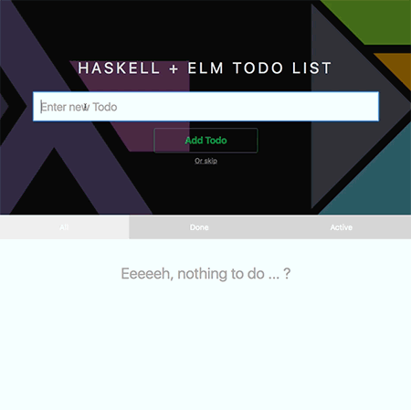

# haskell-elm-todo-app

_**Update 09/24/2019:**_ Support of GHC 8.6.5 and Elm 0.19

Todo app build with [`Haskell`](https://www.haskell.org/) ([`Servant`](http://haskell-servant.github.io/), [`Persistent`](https://hackage.haskell.org/package/persistent)) on server-side and [`Elm`](http://elm-lang.org/) on client-side.



## _Random notes (2016)_

The modular structure of the `Elm` app based on the article "[How I Structure Elm Apps](http://blog.jenkster.com/2016/04/how-i-structure-elm-apps.html)" by [Kris Jenkins](https://github.com/krisajenkins). It also uses the `elm-return` library by [Isaac Shapira](https://github.com/Fresheyeball) for using a [`Writer monad` approach](http://mutanatum.com/posts/2016-09-18-Return.html) with any `update` function.

It might be overkill somehow to use all these things for a simple Todo app. Anyway, I just wanted to check it out what is possible and how does it feel to write a bigger `Elm` application in any future...


## Instructions

### Server-side app

- Build:

``` shell
stack build
```

- Execute:

``` shell
stack exec haskell-elm-todo
```

- Run tests:

``` shell
stack test
```

#### DB queries

by using [httpie](https://github.com/jkbrzt/httpie):

``` shell

# add a todo
http POST localhost:3000/todo/ completed:=false description="my todo"

# get a todo
http localhost:3000/todo/1

# delete a todo
http DELETE localhost:3000/todo/1

# update a todo
http PUT localhost:3000/todo/1 description="any other description" completed:=true

# get all todos
http localhost:3000/todos

```


### Client-side app

- Goto project folder

``` shell
cd {project}/client/
```

- Build:

``` shell
npm i
```

- Run:

``` shell
npm start

```

Open [http://localhost:3333](http://localhost:3333).


## Acknowledge (2016)

### Helpful Haskell / Servant stuff

- Haskell + Persistent: [http://www.yesodweb.com/book/persistent](http://www.yesodweb.com/book/persistent)

- School of Haskell "[Querying an existing database](https://www.schoolofhaskell.com/school/advanced-haskell/persistent-in-detail/existing-database)"

- Example Servant + Persistent: [https://github.com/haskell-servant/example-servant-persistent/](https://github.com/haskell-servant/example-servant-persistent/)

- Example Servant + Persistent by [Matt Parsons](https://github.com/parsonsmatt/): [https://github.com/parsonsmatt/servant-persistent](https://github.com/parsonsmatt/servant-persistent)

- Example Servant + Elm: [https://github.com/haskell-servant/example-servant-elm](https://github.com/haskell-servant/example-servant-elm)

- "Todobackend" with Servant: [https://github.com/jhedev/todobackend-haskell/tree/master/todobackend-servant](https://github.com/jhedev/todobackend-haskell/tree/master/todobackend-servant)

- Album app (Haskell + Elm) by [Magnus Rundberget / @rundis](https://github.com/rundis): [https://github.com/rundis/albums](https://github.com/rundis/albums)

- DB example of "[5 Ways to Test Application Code that Accesses a Database in Haskell](https://github.com/cdepillabout/testing-code-that-accesses-db-in-haskell/)"


### Helpful Elm stuff

- Blog post "[How I Structure Elm Apps](http://blog.jenkster.com/2016/04/how-i-structure-elm-apps.html)" by [Kris Jenkins / @krisajenkins](https://github.com/krisajenkins)

- [Advanced example](https://github.com/krisajenkins/elm-dialog/tree/master/examples/Advanced) of `elm-dialog` by [Kris Jenkins /  @krisajenkins](https://github.com/krisajenkins)

- Blog post ["The Return Monad"](http://mutanatum.com/posts/2016-09-18-Return.html) by [Isaac Shapira / @Fresheyeball](https://github.com/Fresheyeball)


- Blog post ["Optical Swordplay With Components"](https://toast.al/posts/2016-10-20-optical-swordplay-with-components.html) by [Kyle J. Kress / @toastal](https://github.com/toastal)
